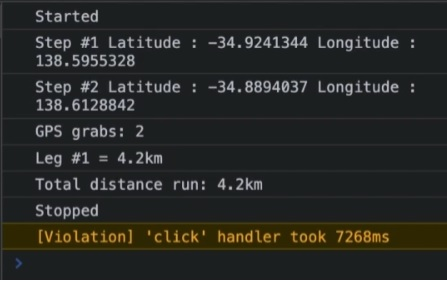

# Team-Runner

## Website URL
https://obscure-fjord-41788.herokuapp.com/


## Goals
My team built this application because the client wanted an app where they are able to track a users distance from their intial destination to their final destination, resulting in a 'x km' has been traveled. This is done while the user is apart of a team where the following elements are shown:

```
1. My run (your individual run distance)
2. My Team (your teams run distance)
3. My goal (how many km/month)
4. Graphs (line graph and team distance graph)
```


## Problems and Solutions
There were many problems that were faced with our team-runner project. The primary problem was involved with using git. Mainly  pushing and merging code. A problem that arose from this was that when trying to merge code with a collaborators code, it would be very time consuming due to merge conflicts. 

We also ran into a problem where merging deleted our main code, so we had to revert the changes and work around the merge by deleting our local repo and git cloning the main. 


## List of Technologies Used
```
1. Geolocation API
2. HTML/Javascript
3. Handlebars
4. Tailwind CSS
5. MySql
6. Express
```

## Collaborators
```
1. Kym Reilly
2. Elsa Li
3. Marcus Lopes
4. George Kaluwin
5. Abhishek Chaudhary
```

## Mock Up
The following images show the web pages appearance:


The following image shows the functionality of the geolocation API based on the users position:


## Video Demonstration
https://drive.google.com/file/d/1BnivkXaUGHDOHl84CKpKfLPSwcUeh3AF/view


## License
	MIT License

	Copyright (c) 2022 Kym Reilly, Elsa Li, Marcus Lopes, George Kaluwin, Abhishek Chaudhary

	Permission is hereby granted, free of charge, to any person obtaining a copy
	of this software and associated documentation files (the "Software"), to deal
	in the Software without restriction, including without limitation the rights
	to use, copy, modify, merge, publish, distribute, sublicense, and/or sell
	copies of the Software, and to permit persons to whom the Software is
	furnished to do so, subject to the following conditions:

	The above copyright notice and this permission notice shall be included in all
	copies or substantial portions of the Software.

	THE SOFTWARE IS PROVIDED "AS IS", WITHOUT WARRANTY OF ANY KIND, EXPRESS OR
	IMPLIED, INCLUDING BUT NOT LIMITED TO THE WARRANTIES OF MERCHANTABILITY,
	FITNESS FOR A PARTICULAR PURPOSE AND NONINFRINGEMENT. IN NO EVENT SHALL THE
	AUTHORS OR COPYRIGHT HOLDERS BE LIABLE FOR ANY CLAIM, DAMAGES OR OTHER
	LIABILITY, WHETHER IN AN ACTION OF CONTRACT, TORT OR OTHERWISE, ARISING FROM,
	OUT OF OR IN CONNECTION WITH THE SOFTWARE OR THE USE OR OTHER DEALINGS IN THE
	SOFTWARE.

## Contact Information
	Kym Reilly: kymreilly.87@gmail.com
	Elsa Li: https://github.com/elsa5152
	Marcus Lopes: https://github.com/marcus-lopes
	George Kaluwin: georgekaluwin@gmail.com
	Abhishek Chaudhary: abhishekchaudhary1442016@gmail.com
	
## Credit
    Kym Reilly
	Elsa Li
	Marcus Lopes
	George Kaluwin
	Abhishek Chaudhary